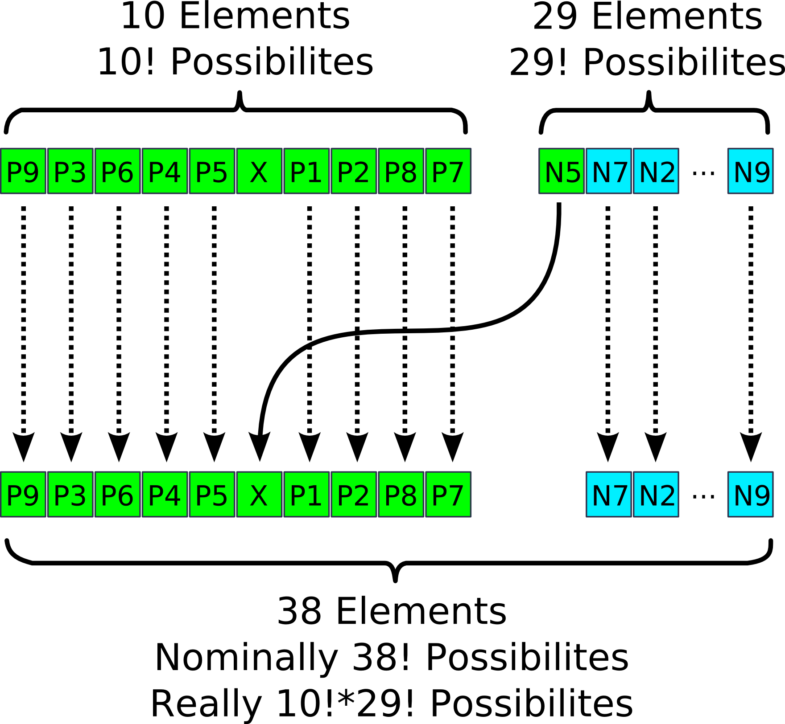

# Seating arrangements proof/explanation

Task: Prove that the probability of a group of 9 guests ending up among the 10 guests with good seats in an audience of 38 is astronomically low (\<0.1%).

Let's call our normal guests N1, N2, N3, ..., N29 and our preferred guests P1, P2, P3, ..., P9.

Now let's consider the "priority" seats (denoted SP1, SP2, ..., SP10). These have 9 preferred guests in them, along with one other guest.

So the seating configuration might look like this:

| SP1 | SP2 | SP3 | SP4 | SP5 | SP6 | SP7 | SP8 | SP9 | SP10|
|-----|-----|-----|-----|-----|-----|-----|-----|-----|-----|
|  P1 |  P2 |  P3 |  P4 |  P5 |  P6 |  P7 |  P8 |  P9 |  X  |

The condition is fulfilled for an arbitrary arrangement of these guests, independent from the guest occupying the seat marked with X, so we have 10! possiblities to arrange the "priority" seats.

Now consider the group of normal guests. They have an additional 28 seats (denoted SN1, SN2, ..., SN28), as well as the one seat marked X among the "priority" seats.

So the seating configuration might look like this:

| SN1 | SN2 | SN3 | ... | SN28|  X  |
|-----|-----|-----|-----|-----|-----|
|  N1 |  N2 |  N3 | ... | N28 | N29 |

The condition is fulfilled for an arbitrary arrangement of these guests, independent of the arrangement of the priority seats, so we have 29! possibilities to arrange the normal guests.

Since the two arrangements are independent from oneother, we have to multiply them to get the total number of favorable cases. In this case that would be 10!\*29!.

See image for arrangement.

Finally we devide the number of favorable cases with the number of non-favorable cases to get 10!\*29!/38!

This is approximately 6.13\*10^-8 or 0.0000000613 or 0.00000613%, *far* less than 0.1%.

*Q.E.D.*
